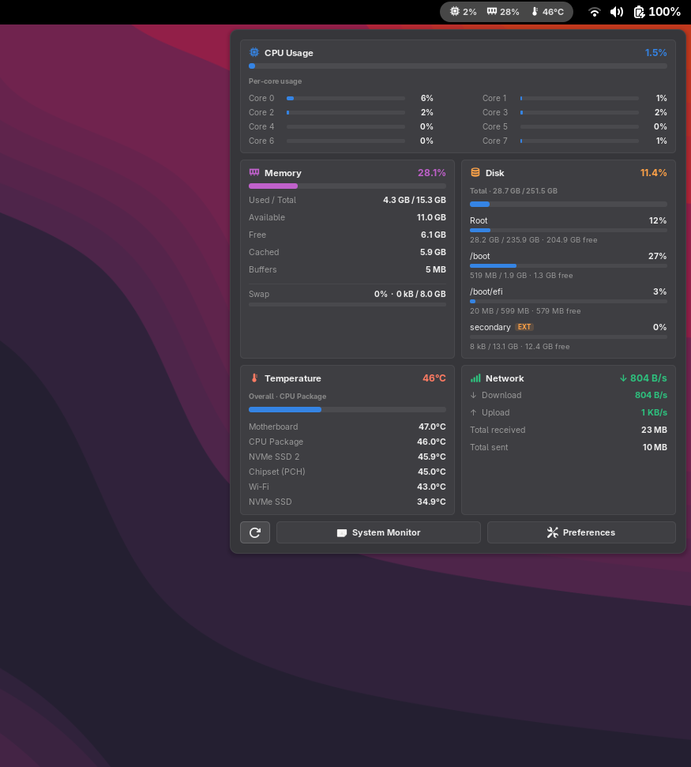

# System Monitor Panel

A GNOME Shell extension that shows **CPU usage, memory usage, disk usage, network speed, and device temperature** right in the top panel, with a rich dropdown dashboard for detailed stats.

<p align="center">
  <a href="https://extensions.gnome.org/extension/10372/system-monitor-panel/">
    
  </a>
</p>

<p align="center">
  <a href="https://extensions.gnome.org/extension/10372/system-monitor-panel/"><strong>Install from GNOME Extensions →</strong></a>
</p>

<p align="center">
  
  
</p>

## Features

- **At-a-glance panel indicators** for CPU, memory, disk, network, and temperature, with color-coded values (normal / warning / critical).
- **Detailed dropdown dashboard** with cards for each metric:
  - **CPU** — overall usage plus a per-core usage grid.
  - **Memory** — used/available/free/cached/buffers breakdown and swap usage.
  - **Disk** — combined usage plus a per-filesystem breakdown, with removable drives optionally included and badged `EXT`.
  - **Network** — live download/upload speeds and cumulative totals since boot.
  - **Temperature** — readings from the significant hardware sensors (CPU, GPU, chipset, motherboard, drives, Wi-Fi), one per component, with the CPU package sensor preferred for the headline value.
- **Configurable refresh interval** (1–300 seconds).
- **Celsius or Fahrenheit** temperature display.
- **Bytes or bits** network speed display (MB/s or Mbps).
- **Configurable panel position** — either end of the left or right panel box.
- **Toggle any metric** on or off, both in the panel and in the dropdown, plus an option to hide icons.
- **Manual refresh** button in the dropdown footer.

<p align="center">
  
</p>
<p align="center"><em>The dropdown dashboard, with a card per metric.</em></p>

## Requirements

- GNOME Shell 48, 49 or 50
- `glib-compile-schemas` (ships with GLib / `glib2-devel`), used to compile the settings schema

Temperature and disk readings come from `/sys/class/thermal`, `/sys/class/hwmon`, and `/proc/mounts`. Machines that expose no readable sensor show `N/A` rather than failing.

## Install

```sh
make install
```

Then log out and back in — GNOME Shell only scans for new extensions at startup,
and on Wayland it cannot be restarted in place. After logging back in:

```sh
make enable
make prefs     # open the preferences window
```

Or install directly from the official GNOME Extensions website:

**https://extensions.gnome.org/extension/10372/system-monitor-panel/**

## Development

```sh
make check     # syntax-check the JS, schema and metadata
make schemas   # compile the GSettings schema
make pack      # build a distributable zip for extensions.gnome.org
make logs      # follow this extension's shell log output
make uninstall
```

Note that changes to an already-loaded extension also require a log out and back
in on Wayland, because the shell caches ES modules for the life of the process.

Do not add a `version` field to [src/metadata.json](src/metadata.json) — extensions.gnome.org
assigns version numbers itself.

## Settings

| Setting                                                        | Default   | Description                                   |
| -------------------------------------------------------------- | --------- | --------------------------------------------- |
| `refresh-interval`                                             | `30`      | Seconds between updates (1–300)               |
| `temperature-unit`                                             | `celsius` | `celsius` or `fahrenheit`                     |
| `network-unit`                                                 | `bytes`   | `bytes` (MB/s) or `bits` (Mbps)               |
| `panel-position`                                               | `right`   | `far-left`, `left`, `right`, or `far-right`   |
| `show-cpu` / `-memory` / `-disk` / `-temperature` / `-network` | on        | Panel indicator for each metric               |
| `show-*-card`                                                  | on        | Dropdown card for each metric                 |
| `show-external-disks`                                          | off       | Include removable/USB drives in the disk card |
| `show-icons`                                                   | on        | Icons in the panel                            |

Settings apply immediately; no reload is needed.

## Layout

| File                                 | Purpose                                                 |
| ------------------------------------ | ------------------------------------------------------- |
| [src/extension.js](src/extension.js) | Panel indicators, dropdown dashboard, metric collection |
| [src/prefs.js](src/prefs.js)         | Preferences window                                      |
| [src/icons/](src/icons/)             | Symbolic panel icons                                    |

## License

GPL-2.0-or-later. See [LICENSE](LICENSE).

This is the license required for submission to
[extensions.gnome.org](https://extensions.gnome.org).

## Notes

The extension runs inside the GNOME Shell compositor process, so everything it does on a timer is on the critical path for desktop responsiveness. A few consequences shape the code in [src/extension.js](src/extension.js):

- **All file IO is asynchronous.** `statfs` blocks in uninterruptible sleep on a device that has stopped responding — a drive unplugged without unmounting, say — so a synchronous call would freeze the whole desktop. `query_filesystem_info_async` hands the syscall to a GIO worker thread instead, and the `/proc` and `/sys` readings go through `load_contents_async` the same way, keeping every read off the compositor thread.
- **Static metadata is cached.** Sensor paths are discovered once; mount points and each device's removable flag are cached and invalidated by `GioUnix.MountMonitor`. Only the values themselves are re-read on each refresh.
- **Nothing is collected for pixels that will not be drawn.** A metric is read only when its panel label is visible, or its card is visible and the dropdown is actually open. Dropdown rows are reused across refreshes rather than rebuilt.

Together these keep a short refresh interval (1–5 seconds) about as cheap as the 30-second default.
